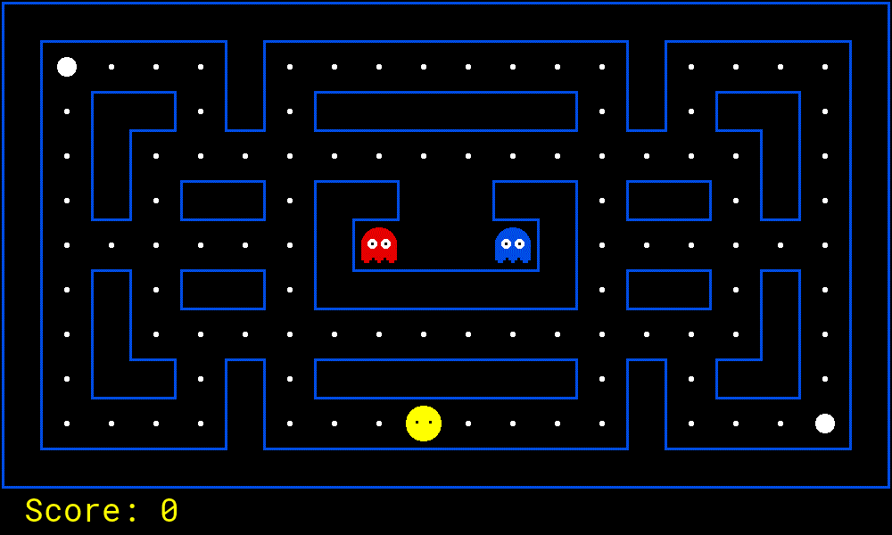

# Project 0: Unix/Python Tutorial

<p align="center">
    
    </br>
    We want some Pac-Man!</br>
    Environmental setup</br>
    first, Pac-Man after.
</p>

## Introduction

This project will cover the basics of working in a Unix environment,
a small introduction to Python,
and the basics of working with the autograding tools you will be using all quarter.
In this course, we will only be using **Python 3** (>= 3.8).

In this course, you may use whatever machine you choose:
your own computer, the [SOE servers](https://support.soe.ucsc.edu/linux-servers),
UCSC lab machines, or some other option.
The code and assignments should work on Linux, Mac, and Windows.
As this is a 100-level course,
you are responsible for getting your development environment setup and reaching any missing pieces.

### Resources

We anticipate that students in this course will have a variety of preparation and prior exposure to tools such as
the command-line, powerful text-editors (such as vim), version control software (such as git), etc.
While we have included links to resources and documentation for some of the tools we expect you to use in this course,
a more comprehensive introductory source is provided by MIT under the course title
["The Missing Semester of your CS Education"](https://missing.csail.mit.edu/).

While this material is not required,
setting up and learning to use proper tools can save you hundreds of hours of work over the course of your undergraduate education,
and having experience with these tools will serve you well in the job market.
Even experienced students are likely to benefit from the linked content!

#### UNIX

 * [UNIX Tutorial for Beginners](http://www.ee.surrey.ac.uk/Teaching/Unix/)
 * [UNIX Tutorial](https://people.ischool.berkeley.edu/~kevin/unix-tutorial/toc.html)

#### Text Editors

Being familiar with a powerful text editor can make a surprising difference.
In the programming world, there are two text editors that have stayed on the top for over 30 years.
[Vim (Vi)](https://en.wikipedia.org/wiki/Vim_(text_editor))
and [Emacs](https://en.wikipedia.org/wiki/Emacs) are two very powerful terminal-based text editors (although both have GUI versions).
The arguments about which one is better have been going on for decades and will never be resolved.
In truth, they are both amazing editors and will greatly increase your productivity once you learn how to use them.
There are also many online resources for each:

- Vim
  - [Interactive Vim Tutorial](https://www.openvim.com/)
  - [Visual Vim Tutorial](https://scotch.io/tutorials/getting-started-with-vim-an-interactive-guide)
  - [Vim Videos](http://derekwyatt.org/vim/tutorials/)
  - [Game-based Vim Tutorial](https://vim-adventures.com/)
- Emacs
  - [Practical Emacs Tutorial](http://ergoemacs.org/emacs/emacs.html)
  - [Another Emacs Tutorial](https://www.gnu.org/software/emacs/tour/)
  - [Visual Emacs Tutorial](http://www.jesshamrick.com/2012/09/10/absolute-beginners-guide-to-emacs/)

You may choose to write code however you wish,
these are just two tried and true options.

#### Git

Git is currently the most popular [Version Control System](https://en.wikipedia.org/wiki/Version_control), period.
Learning how to use source control is a must for all programmers in today's world.
We **strongly** encourage all students to use source control for their coursework.
Of course, keep your repositories private so other students cannot see.
Here are several resources for learning how to use git:

- [The full Pro Git book](https://git-scm.com/book/en/v2)
- [Git for Computer Scientists](https://eagain.net/articles/git-for-computer-scientists/)
- [A Visual Git Reference](http://marklodato.github.io/visual-git-guide/index-en.html?no-svg)
- [A git Primer](https://danielmiessler.com/study/git/)
- [Text Tutorial](https://nulab.com/learn/software-development/git-tutorial/git-basics/)
- [Video Tutorial](https://www.youtube.com/watch?v=RGOj5yH7evk)
- [Official Online Book](https://git-scm.com/book/en/v2/Getting-Started-About-Version-Control)

For hosting our Git repositories, we will be using [GitHub](https://github.com/).
It is free to use and allows you to make unlimited private repositories.
You are free to use whatever option you wish to host your git repos,
but course assistants will not be able to provide support on any hosting service but GitHub.

#### Python

In this course, we will be using Python (version >= 3.8).
If you don't already have Python installed,
instructions for your OS can be found [here](https://wiki.python.org/moin/BeginnersGuide/Download).
If you are new to Python environments,
We recommend that you try to only have one version of Python installed on your machine at a time
(it is possible to have multiple version, but that can get pretty confusing).

To check your already installed Python version, use:
```sh
python3 -V
```

Since Python is one of the
[most popular](https://insights.stackoverflow.com/survey/2018/#technology-programming-scripting-and-markup-languages)
programming languages,
there are many online resource available for it.
Here are just a few useful resources:

- [Text Tutorial](https://overiq.com/python-101/)
- [Video Tutorial](https://www.youtube.com/watch?v=eWRfhZUzrAc)
- [The full "Think Python" Book](https://greenteapress.com/wp/think-python-2e/)
- [Official Tutorial](https://docs.python.org/3/tutorial/index.html)
- [Official Beginning Guide](https://wiki.python.org/moin/BeginnersGuide)
- [Hitchhiker's Guide to Python](https://docs.python-guide.org/index.html)
- [Data Structures in Python (Official)](https://docs.python.org/3/tutorial/datastructures.html#)
- [Data Structures in Python (Unofficial)](https://python.swaroopch.com/data_structures.html)
- [List Comprehensions in Python](https://docs.python.org/3/tutorial/datastructures.html#list-comprehensions)
- [Lambda Functions in Python](https://docs.python.org/3/tutorial/controlflow.html#lambda-expressions)

Note that we will typically use the `python3` command.
Because of the breaking changes between Python 2 and 3,
when you install Python on your machine an additional executable called `python2` or `python3`
(depending on the version of Python you installed)
will also be installed on your machine.
Since this course only uses Python 3,
any use of the `python` command refers to `python3`.
This also applies to the `pip` and `pip3` commands.

#### Virtual Environments

In Python, code that is not your own or apart of the [Python standard library](https://docs.python.org/3/library/index.html)
is considered a third-party package (sometimes just shortened to "Python packages" or just "packages").
Each package can be associated with different versions and require specific versions of other packages as dependencies.
Since it can be hard (or maybe even impossible) to get a set of packages that satisfy the versions of every package needed,
we use a tool called [virtual environments](https://packaging.python.org/en/latest/guides/installing-using-pip-and-virtual-environments/#creating-a-virtual-environment), or "venvs" for short.
Virtual environments lets you create as many environments as you want and install a different set of packages (or package versions) to each venv (you can even use different versions of Python).
For example, maybe you are working on this class which uses a new version of the pandas package,
but you are also maintaining an old piece of code you wrote 5 years ago that uses an older version of pandas.
You can just create a venv for each project and have both versions of pandas installed on your machine at the same time.

In this course, we will be using the [standard venv tool](https://docs.python.org/3/library/venv.html) distributed with Python.
(You can use others, but the TAs cannot officially help you with them.)
[This guide](https://packaging.python.org/en/latest/guides/installing-using-pip-and-virtual-environments/#creating-a-virtual-environment)
covers how to create an use venvs,
we will reiterate the steps here.
(For Windows, some of the commands are different from the ones listed here, but the general steps are the same.
Refer to the linked guide for the exact commands.)
Before using a venv, you must create it:
```sh
python3 -m venv cse140_venv
```
(In this document, we will assume that your venv is called `cse140_venv` and it is located in the same directory you are running commands in.)
Once created, a venv will be a normal directory that holds all of its information and packages.
To use your newly created venv, you will need to [activate](https://packaging.python.org/en/latest/guides/installing-using-pip-and-virtual-environments/#activating-a-virtual-environment) it:
```sh
source cse140_venv/bin/activate
```
Now you may notice that your shell prompt has changed, this is a sign that the venv is working.
With your venv activated, any packages you install will automatically be installed to the venv,
and any packages used/imported will come from the venv.
If you want to stop using the venv, you can just deactivate it at any time:
```sh
deactivate
```
Note that your shell prompt should have changed back.
Your venv can be re-activated at any time in the same way as before.

#### Required Packages

This repository contains a [requirements.txt](../requirements.txt) file that lists
all the required Python packages for this course.
In this course, you are only allowed to use packages that in the
[Python Standard Library](https://docs.python.org/3/library/)
or specified in this [requirements.txt](../requirements.txt) file.

To install these packages, first make sure you are in your [virtual environment](#virtual-environments),
and then run the command:
```sh
pip3 install -r requirements.txt
```

Note that this assumes you are in the same directory as the requirements file.
Just point to the file if you are somewhere else
(e.g., use `../requirements.txt` if you are in this assignment's directory).

You may choose to use another packaging system instead of pip (like Conda),
but TAs will not be able to assist you with any environment or package issues.

#### Tk

To run any Pac-Man code that uses visuals, you will need to install a library called [Tk](https://tkdocs.com/tutorial/install.html).
There is a version for pretty much all operating system,
and you should be able to follow the simple [installation instructions](https://tkdocs.com/tutorial/install.html).

You may already have Tk installed,
and can skip this step!
To test, run the following command:
```sh
python3 -c 'import tkinter ; tkinter._test()'
```

If a window pops up, then you should be all set!

### Submission

The purpose of this assignment it to get you familiar with the development environment we will be using for this course.
As such, this assignment will be much simpler and easier than all the other assignments this quarter.
Take this as a chance to make sure your environment is all set up and learn about (or refresh yourself)
on the tools we will be using this quarter (like Python, git, and virtual environments).

The artifacts for this assignment (what you will submit) consists of two files:
- [buyLotsOfFruit.py](buyLotsOfFruit.py)
- [shopSmart.py](shopSmart.py)

We also provide you with some files you will need for this assignment:
- [README.md](README.md) -- This file!
- [shop.py](shop.py) -- A file you will need to run the assignment (will be described later).
- [config.json](config.json) -- A file that tells the autograder how to submit your assignment.

Of these files, the one important for submission is [config.json](config.json).
This contains all your information for submitting to the autograder.
If you open it up, you will see the following information:
- `course` -- The current course you are enrolled in (already set).
- `assignment` -- The current assignment you are working on (already set).
- `server` -- The autograding server to submit assignment to (already set).
- `user` -- Your username (email) for the autograder.
- `pass` -- The password that was emailed to you in the beginning of this course.
  If you didn't get the password, forgot it, etc; talk to a TA.
  You can also reset or change your password if you want.

For example, Sammy Slug would have a `config.json` for P0 that looks like:
```json
    {
        "course": "CSE140-QXX",
        "assignment": "p0",
        "server": "http://lighthouse.soe.ucsc.edu",
        "user": "sslug@ucsc.edu",
        "pass": "1234567890"
    }
```

When you are ready to submit,
first make sure you are in your [virtual environment](#virtual-environments),
you have installed the [requirements for this course](#required-packages),
and you are in the assignment directory.
(You can technically submit from any directory, but you will have to edit the commands we give you.)
Then, you can you can do so using the command:
```sh
python3 -m autograder.run.submit buyLotsOfFruit.py shopSmart.py
```

This will take your `config.json`, `buyLotsOfFruit.py`, and `shopSmart.py` from your current directory,
and send them to the autograding server.
The autograder will get your code and run a bunch of secret tests on it to assign you a grade.

The autograder records all your submissions
(the code, time, and score).
The score you received on your most recent submission is
your current grade for the assignment
(not counting late assignments and manually graded components).

You can make as many attempts as you want.
However if we find you abusing the autograder (e.g. repeatedly failing tests that would have been caught by testing locally),
then you can lose points.
Any attempt to willingly circumvent the autograder (e.g. "hacking" it)
may result in an immediate F in this class and a referral for academic integrity.

### Academic Dishonesty

We will be checking your code against other submissions in the class for logical redundancy.
If you copy someone else's code and submit it with minor changes, we will know.
These cheat detectors are quite hard to fool, so please don't try.
We trust you all to submit your own work only; _please_ don't let us down.
If you do, we will pursue the strongest consequences available to us.

### Getting Help

You are not alone!
If you find yourself stuck on something, contact the course staff for help.
Office hours, section, and Piazza are there for your support; please use them.
If you can't make our office hours, let us know and we will schedule more.
We want these projects to be rewarding and instructional, not frustrating and demoralizing.
But, we don't know when or how to help unless you ask.
One more piece of advice: if you don't know what a variable does or what kind of values it takes, print it out.

## Part 1: The Fruit Shop

For this part of the assignment,
you will be filling in two methods in two different Python files.

### Problem 1: Buy Lots Of Fruit

Implement the `buyLotsOfFruit` function in the [buyLotsOfFruit.py](buyLotsOfFruit.py) file.
This function will take a list of `(fruit, weight)` tuples and returns the cost of your list.
If there is some fruit in the list which doesn't appear in `FRUIT_PRICES`,
your function should print an error message and return `None` (which is like `null` in C and Java).

Please do not change the `FRUIT_PRICES` dict.

### Problem 2: Shop Smart

Implement the `shopSmart` function in the [shopSmart.py](shopSmart.py) file.

This function takes two arguments:
1. `orderList` -- A list like the one passed in to `buyLotsOfFruit()`.
2. `fruitShops` -- A list of `FruitShop`.

This function returns the `FruitShop` where your total order costs the least amount.

Don't change the file name or variable names, please.
Note that we will provide the [shop.py](shop.py) implementation as a "support" file,
so you don't need to submit yours.

### Frequent Errors

Here are some common problems (and their solutions) that new Python students have:

#### NameError: ... not defined

**Problem:**

You get the following error when running your program:
```
NameError: name 'my_variable' is not defined
```

**Solution:**

To access a member of a module, you have to type `module_name.member_name`, where `module_name` is the name of the `.py` file,
and `member_name` is the name of the variable (or function) you are trying to access.

#### TypeError: ... dict is not callable

**Problem:**

You get the following error when running your program:
```
TypeError: 'dict' object is not callable
```

**Solution:**

Dictionary looks up are done using square brackets: [ and ].
NOT parenthesis: ( and ).

#### ValueError: ... too many values to unpack

**Problem:**

You get the following error when running your program:
```
ValueError: too many values to unpack
```

**Solution:**

Make sure the number of variables you are assigning to a variable or in a `for`
loop matches the number of elements in each item of the list.
Similarly for working with tuples.

For example, if `pair` is a tuple of two elements (e.g. `pair = ('apple', 2.0)`),
then the following code would cause the "too many values to unpack error":
```python
pair = ('apple', 2.0)
(a, b, c) = pair
```

Here is a problematic scenario involving a `for` loop:
```python
pairList = [('apples', 2.00), ('oranges', 1.50), ('pears', 1.75)]
for fruit, price, color in pairList:
    print('%s fruit costs %f and is the color %s' % (fruit, price, color))
```

Note that each element in the list has two items,
but the loop tries to represent each item with three elements (`fruit, price, color`).

#### AttributeError: 'list' object has no attribute 'length'

**Problem:**

You get the following (or similar) error when running your program:
```
AttributeError: 'list' object has no attribute 'length'
```

**Solution:**

Finding length of lists is done using `len(myList)`.

## Part 2: Working with the Autograder

All your programming assignments will be graded by a system we call "the autograder".
Once you submit an assignment to the autograder,
it will test your code against secret test cases written by the TAs and assign your submission a score which it will send back to you.
You can make as many attempts/submissions as you want.
However, you should make sure to not abuse the autograder by using is as a complier or style checker.
You should always run your own local tests (and style checker) before submitting to the autograder.
When the autograder does not give you full credit for a task,
try making a test case that is testing the same thing the autograder is and run your new test locally.
Remember, the autograder is a shared resource for all students and you should be respectful by testing locally first.

The score for your most recent submission is considered your current score on the assignment
(ignoring late days and any manually graded components).
Be careful when submitting past the assignment's deadline, because you will start using your late days.
The current grade the autograder assigns you is considered official and will eventually be reflected on Canvas
(which will be regularly updated with your most recent submission).
It can take up-to six hours for an autograder score to be reflected in Canvas.

### Interacting with the Autograder

All interaction with the autograder is done using the autograder tools included in `autograder-py`
dependency listed in this repository's [requirements.txt](../requirements.txt) file.
See [the documentation](https://github.com/edulinq/autograder-py) for a full list of all the autograder tools.

You can list out all the available tools using:
```sh
python3 -m autograder.run
```

You can also get specific help for each tool using `--help`:
```sh
python3 -m autograder.run.submit --help
```

The tool has options to configure how it runs (as seen in the help prompt),
but as long as you run the tool in your assignment directory (the one that this file lives in)
then all the default options should work just fine.

For this course, you will only need to use commands in the `autograder.run` package of shortcuts.
But, if you want to see ALL the commands available to you,
you can look into the `autograder.cli` package:
```sh
python3 -m autograder.cli -r
```

#### Submitting

To submit your code, you can use the `submit` command:
```sh
python3 -m autograder.run.submit buyLotsOfFruit.py shopSmart.py
```

If the grading was successful, then you will see output that is very similar to the local grader.
For example, you may see output like:
```
The autograder successfully graded your assignment.
Autograder transcript for assignment: P0.
Grading started at 2023-01-02 03:04 and ended at 2023-01-02 03:04.
Q1: 1 / 1
Q2: 1 / 1
Style: 0 / 0
   Style is clean!

Total: 2 / 2
```

Your score on the assignment is determined by your most recent submission to the autograder.
You can see the exact time the autograder accepted your submission by looking at the grading report it outputs.
The time after "Grading started at" is your official submission time and will be used to compute any late days.

Note that this submission step is **required** for getting a grade for hands-on assignments.
Just pushing your code in git (as some classes do) is not sufficient for receiving a grade.
Since pushing code and getting graded are not linked in this class,
we encourage you to commit and push your code in git often.

For P0, no points are awarded for having correct coding style,
but that will change starting with P1.
The Pac-Man repo will contain utilities for checking style.

#### Checking Your Last Score

You can ask the autograder to show you your last submission using the `peek` command:
```sh
python3 -m autograder.run.peek
```

If the lookup was successful, then you will see output that is very similar to when you submitted your code originally.
For example, you may see output like:
```
The autograder successfully found your last attempt for this assignment.
Autograder transcript for assignment: P0.
Grading started at 2023-01-02 03:04 and ended at 2023-01-02 03:04.
Q1: 1 / 1
Q2: 1 / 1
Style: 0 / 0
   Style is clean!

Total: 2 / 2
```

#### Checking Your Score History

To check all your previous scores for this assignment, you can use the `history` command:
```sh
python3 -m autograder.run.history
```

This command will return a summary of your past submissions, like:
```
Found 2 submissions.
    Submission ID: 1695682455, Score: 0 / 2, Time: 2023-09-25 17:54.
    Submission ID: 1695735313, Score: 2 / 2, Time: 2023-09-26 08:35, Message: 'I did it!'
```

## Part 3: Playing Pac-Man

To finish up this assignment,
let's plat a game of Pac-Man!
You will be working with the same Pac-Man repo for the rest of the assignments in this course,
so let's get used to working with it now.

First, make sure that you are in your [virtual environment](#virtual-environments),
and have installed the [requirements for this course](#required-packages)
([including Tk](#tk)).

Now get the Pac-Man repo we will use in this course:
[github.com/linqs/pacman](https://github.com/linqs/pacman).
Note that this is a "template repository" on GitHub,
so you can use "Use this template" button on the repo's page to create your own **PRIVATE** copy of this repo.
It is critical that you make your repository **PRIVATE**,
since you will be putting your assignment code in it.
Sharing code is considered cheating,
so if you leave your repository public and someone uses your code,
you can be considered complicit in cheating.

Once you have your own private version of the Pac-Man repo,
clone it and move into in.
To start a game of Pac-Man that you can control with the arrow keys,
all you need to do is run:
```sh
python3 -m pacai.bin.pacman
```

Once you can run a game of Pac-Man,
you are all set for the rest of the assignments in this course!

_Have Fun!_
