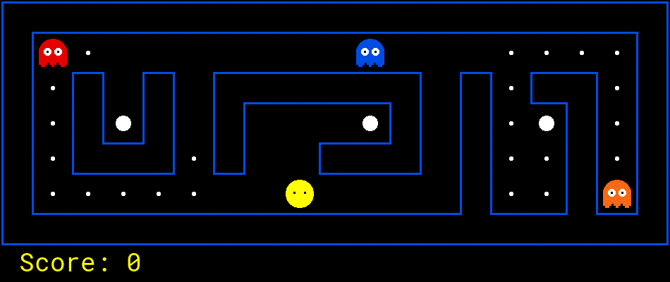

# Project 3: Reinforcement Learning

<p align="center">
    
    </br>
    Pac-Man seeks reward.<br/>
    Should he eat or should he run?<br/>
    When in doubt, q-learn.
</p>

## Introduction

In this project, you will implement value iteration and q-learning.
You will test your agents first on Gridworld (from class),
then apply them to a simulated robot controller (Crawler) and Pac-Man.

The code for this project consists of several Python files,
some of which you will need to read and understand in order to complete the assignment, and some you can glance over.

### Submission

You will fill in portions of
[`pacai/student/valueIterationAgent.py`](https://github.com/linqs/pacman/blob/main/pacai/student/valueIterationAgent.py)
and [`pacai/student/qlearningAgents.py`](https://github.com/linqs/pacman/blob/main/pacai/student/qlearningAgents.py)
during this assignment.
You should **only** submit these two files.

For instructions on submission,
refer back to the [P0 README](../p0/README.md).
for example, you may submit with the command:
```sh
python3 -m autograder.cli.submission.submit pacai/student/valueIterationAgent.py pacai/student/qlearningAgents.py pacai/student/analysis.py
```

### Evaluation

Your code will be autograded for technical correctness.
Please _do not_ change the names of any provided functions or classes within the code,
or you will wreak havoc on the autograder (and points will be deducted!).
However, you are allowed to add any new classes or function that you need.
The correctness of your implementation -- not the autograder's output -- will be the final judge of your score.
If necessary, we will review and grade assignments individually to ensure that you receive due credit for your work.
This assignment is graded out of 30 points.
25 points will be for correctness as determined by the autograder and the point system given below for each problem.
5 points will be for style, which the autograder will also check.
You can run the style checker using the `run_style.sh` script in the project root.

### Academic Dishonesty

We will be checking your code against other submissions in the class for logical redundancy.
If you copy someone else's code and submit it with minor changes, we will know.
These cheat detectors are quite hard to fool, so please don't try.
We trust you all to submit your own work only; _please_ don't let us down.
If you do, we will pursue the strongest consequences available to us.

### Getting Help

You are not alone!
If you find yourself stuck on something, contact the course staff for help.
Office hours, section, and Piazza are there for your support; please use them.
If you can't make our office hours, let us know and we will schedule more.
We want these projects to be rewarding and instructional, not frustrating and demoralizing.
But, we don't know when or how to help unless you ask.
One more piece of advice: if you don't know what a variable does or what kind of values it takes, print it out.

### Code

All the code for this (and later projects) is available in this repository:
[https://github.com/linqs/pacman](https://github.com/linqs/pacman).
The only files you should edit are located in the
[pacai.student](https://linqs.github.io/pacman/docs/latest/pacai/student/index.html) package.
You should **not** use any third-party libraries,
but the [Python Standard Library](https://docs.python.org/3/library/) is fair-game.
If a bug is found in the code (non-student) code,
then the class will be alerted and you will have to pull the changes from this repository.

Any commands provided throughout these instructions are to be executed from the project root directory
(the one with the `README.md` and `LICENSE.md` files).

- States
  - [pacai.core.gamestate.AbstractGamestate](https://linqs.github.io/pacman/docs/latest/pacai//core/gamestate.html#pacai.core.gamestate.AbstractGameState)
  - [pacai.bin.pacman.PacmanGameState](https://linqs.github.io/pacman/docs/latest/pacai/bin/pacman.html#pacai.bin.pacman.PacmanGameState)
- Other Binaries
  - [pacai.bin.crawler](https://linqs.github.io/pacman/docs/latest/pacai/bin/crawler.html)
  - [pacai.bin.gridworld](https://linqs.github.io/pacman/docs/latest/pacai/bin/gridworld.html)
- Utilities
  - [pacai.util.probability.flipCoin](https://linqs.github.io/pacman/docs/latest/pacai/util/probability.html#pacai.util.probability.flipCoin)

## MDPs

To get started, run Gridworld in manual control mode, which uses the arrow keys:
```sh
python3 -m pacai.bin.gridworld --manual
```

You will see the two-exit layout from class.
The blue dot is the agent.
Note that when you press _up_, the agent only actually moves north 80% of the time.
Such is the life of a Gridworld agent!

You can control many aspects of the simulation.
A full list of options is available by running:
```sh
python3 -m pacai.bin.gridworld --help
```

The default agent moves randomly
```sh
python3 -m pacai.bin.gridworld --grid MazeGrid
```

You should see the random agent bounce around the grid until it happens upon an exit.
Not the finest hour for an AI agent.

_Note:_
The Gridworld MDP is such that you first must enter a pre-terminal state (the double boxes shown in the GUI) and then take the special 'exit' action before the episode actually ends.
In this case, the true terminal state is called `TERMINAL_STATE`, which is not shown in the GUI.
If you run an episode manually, your total return may be less than you expected, due to the discount rate (`--discount` to change; 0.9 by default).

Look at the console output that accompanies the graphical output.
You should see information about each transition the agent experiences.
You can turn this off by using `--quiet` or augment it using `--debug`.
You can also run in text-only mode using `--text-graphics`.

As in Pac-Man, positions are represented by `(x, y)` Cartesian coordinates.
Thus any arrays are indexed by `[x][y]` with `'north'` being the direction of increasing `y`, etc.
By default, most transitions will receive a reward of zero, though you can change this with the living reward option (`--living-reward`).

### Question 1 (6 points)

Write a value iteration agent in
[pacai.student.valueIterationAgent.ValueIterationAgent](https://linqs.github.io/pacman/docs/latest/pacai/student/valueIterationAgent.html#pacai.student.valueIterationAgent.ValueIterationAgent).
Your value iteration agent is an offline planner, not a reinforcement agent.
This means the relevant training option is the number of iterations of value iteration it should run (option `--iterations`) in its initial planning phase.
A [ValueIterationAgent](https://linqs.github.io/pacman/docs/latest/pacai/student/valueIterationAgent.html#pacai.student.valueIterationAgent.ValueIterationAgent)
takes an MDP on construction and runs value iteration for the specified number of iterations.

Value iteration computes k-step estimates of the optimal values, $V_k$.
In addition to running value iteration,
implement the following methods for
[ValueIterationAgent](https://linqs.github.io/pacman/docs/latest/pacai/student/valueIterationAgent.html#pacai.student.valueIterationAgent.ValueIterationAgent) using $V_k$.

- [getValue(state)](https://linqs.github.io/pacman/docs/latest/pacai/student/valueIterationAgent.html#pacai.student.valueIterationAgent.ValueIterationAgent.getValue)
  returns the value of a state.
- [getPolicy(state)](https://linqs.github.io/pacman/docs/latest/pacai/student/valueIterationAgent.html#pacai.student.valueIterationAgent.ValueIterationAgent.getPolicy)
  returns the best action according to computed values.
- [getQValue(state, action)](https://linqs.github.io/pacman/docs/latest/pacai/student/valueIterationAgent.html#pacai.student.valueIterationAgent.ValueIterationAgent.getQValue)
  returns the q-value of the (state, action) pair.

These quantities are all displayed in the GUI:
values are numbers in squares, q-values are numbers in square quarters, and policies are arrows out from each square.

_Important:_
Use the "batch" version of value iteration where each vector $V_k$ is computed from a fixed vector $V_{k-1}$ (like in lecture),
not the "online" version where one single weight vector is updated in place.
The difference is discussed in [Sutton & Barto](http://incompleteideas.net/book/RLbook2018.pdf#page=97) starting in 4th paragraph of section 4.1.

_Note:_
A policy synthesized from values of depth k (which reflect the next k rewards) will actually reflect the next k+1 rewards (i.e. you return $\pi_{k+1}$).
Similarly, the q-values will also reflect one more reward than the values (i.e. you return $Q_{k+1}$).
You may assume that 100 iterations is enough for convergence in the questions below.

The following command loads your
[ValueIterationAgent](https://linqs.github.io/pacman/docs/latest/pacai/student/valueIterationAgent.html#pacai.student.valueIterationAgent.ValueIterationAgent),
which will compute a policy and execute it 10 times.
Press a key to cycle through values, q-values, and the simulation.
You should find that the value of the start state (`V(start)`) and the empirical resulting average reward are quite close.

```sh
python3 -m pacai.bin.gridworld --agent value --iterations 100 --episodes 10
```

_Hint:_
On the default BookGrid, running value iteration for 5 iterations should give you the following output.

```sh
python3 -m pacai.bin.gridworld --agent value --iterations 5
```

<p align="center">
    
</p>

Your value iteration agent will be graded on a new grid.
We will check your values, q-values, and policies after fixed numbers of iterations and at convergence (e.g. after 100 iterations).

### Question 2 (1 point)

On `BridgeGrid` with the default discount of 0.9 and the default noise of 0.2, the optimal policy does not cross the bridge.
Change only **ONE** of the discount and noise parameters so that the optimal policy causes the agent to attempt to cross the bridge.
Put your answer in [pacai.student.analysis.question2](https://linqs.github.io/pacman/docs/latest/pacai/student/analysis.html#pacai.student.analysis.question2).
Note: noise refers to how often an agent ends up in an unintended successor state when they perform an action.
The default corresponds to:
```sh
python3 -m pacai.bin.gridworld --agent value --iterations 100 --grid BridgeGrid --discount 0.9 --noise 0.2
```

### Question 3 (5 points)

Consider the `DiscountGrid` layout, shown below.
This grid has two terminal states with positive payoff (shown in green),
a close exit with payoff +1 and a distant exit with payoff +10.
The bottom row of the grid consists of terminal states with negative payoff (shown in red).
Each state in this "cliff" region has payoff -10.
The starting state is the yellow square.

We distinguish between two types of paths:
1. Paths that "risk the cliff" and travel near the bottom row of the grid.
   These paths are shorter but risk earning a large negative payoff.
   These paths are represented by the red arrow in the figure below.
2. Paths that "avoid the cliff" and travel along the top edge of the grid.
   These paths are longer but are less likely to incur huge negative payoffs.
   These paths are represented by the green arrow in the figure below:

<p align="center">
    
</p>

Give an assignment of parameter values for discount, noise,
and living-reward which produce the following optimal policy types or state that the policy is impossible by returning the constant `NOT_POSSIBLE`.
The default corresponds to:
```sh
python3 -m pacai.bin.gridworld --agent value --iterations 100 --grid DiscountGrid --discount 0.9 --noise 0.2 --living-reward 0.0
```

1. Prefer the close exit (+1), risking the cliff (-10).
2. Prefer the close exit (+1), but avoiding the cliff (-10).
3. Prefer the distant exit (+10), risking the cliff (-10).
4. Prefer the distant exit (+10), avoiding the cliff (-10).
5. Avoid both exits (also avoiding the cliff).

Now code [analysis.question3a](https://linqs.github.io/pacman/docs/latest/pacai/student/analysis.html#pacai.student.analysis.question3a)
through [analysis.question3e](https://linqs.github.io/pacman/docs/latest/pacai/student/analysis.html#pacai.student.analysis.question3e)
by returning a 3-item tuple of discount, noise, living reward.
If no answer is possible, return the constant `NOT_POSSIBLE`.

_Note:_
You can check your policies in the GUI.
For example, using a correct answer to 3(a),
the arrow in (0, 1) should point east,
the arrow in (1, 1) should also point east,
and the arrow in (2, 1) should point north.

## Q-learning

Note that your value iteration agent does not actually learn from experience.
Rather, it ponders its MDP model to arrive at a complete policy before ever interacting with a real environment.
When it does interact with the environment,
it simply follows the precomputed policy (e.g. it becomes a reflex agent).
This distinction may be subtle in a simulated environment like a Gridword,
but it's very important in the real world, where the real MDP is not available.

### Question 4 (5 points)

You will now write a q-learning agent, which does very little on construction,
but instead learns by trial and error from interactions with the environment through its
[update(state, action, nextState, reward)](https://linqs.github.io/pacman/docs/latest/pacai/agents/learning/reinforcement.html#pacai.agents.learning.reinforcement.ReinforcementAgent.update) method.
A stub of a q-learner is specified in
[pacai.student.qlearningAgents.QLearningAgent](https://linqs.github.io/pacman/docs/latest/pacai/student/qlearningAgents.html#pacai.student.qlearningAgents.QLearningAgent)
and you can select it with the command line option `--agent q`.
For this question, you must implement the
[update](https://linqs.github.io/pacman/docs/latest/pacai/agents/learning/reinforcement.html#pacai.student.qlearningAgents.QLearningAgent.update),
[getQValue](https://linqs.github.io/pacman/docs/latest/pacai/student/qlearningAgents.html#pacai.student.qlearningAgents.QLearningAgent.getQValue),
[getValue](https://linqs.github.io/pacman/docs/latest/pacai/student/qlearningAgents.html#pacai.student.qlearningAgents.QLearningAgent.getValue),
and [getPolicy](https://linqs.github.io/pacman/docs/latest/pacai/student/qlearningAgents.html#pacai.student.qlearningAgents.QLearningAgent.getPolicy)
methods in [QLearningAgents](https://linqs.github.io/pacman/docs/latest/pacai/student/qlearningAgents.html#pacai.student.qlearningAgents.QLearningAgent).

_Note:_
For [getValue](https://linqs.github.io/pacman/docs/latest/pacai/student/qlearningAgents.html#pacai.student.qlearningAgents.QLearningAgent.getValue)
and [getPolicy](https://linqs.github.io/pacman/docs/latest/pacai/student/qlearningAgents.html#pacai.student.qlearningAgents.QLearningAgent.getPolicy),
you should break ties randomly for better behavior.
The `random.choice()` function will help.
In a particular state, actions that your agent _hasn't_ seen before still have a Q-value, specifically a Q-value of zero,
and if all of the actions that your agent _has_ seen before have a negative Q-value, an unseen action may be optimal.

_Important:_ Make sure that you only access Q values by calling
[getQValue](https://linqs.github.io/pacman/docs/latest/pacai/student/qlearningAgents.html#pacai.student.qlearningAgents.QLearningAgent.getQValue)
in your [getValue](https://linqs.github.io/pacman/docs/latest/pacai/student/qlearningAgents.html#pacai.student.qlearningAgents.QLearningAgent.getValue)
and [getPolicy](https://linqs.github.io/pacman/docs/latest/pacai/student/qlearningAgents.html#pacai.student.qlearningAgents.QLearningAgent.getPolicy) functions.
This abstraction will be useful for question 9 when you override
[getQValue](https://linqs.github.io/pacman/docs/latest/pacai/student/qlearningAgents.html#pacai.student.qlearningAgents.QLearningAgent.getQValue)
to use features of state-action pairs rather than state-action pairs directly.

With the q-learning update in place, you can watch your q-learner learn under manual control, using the keyboard:
```sh
python3 -m pacai.bin.gridworld --agent q --episodes 5 --manual
```

Recall that `--episodes` will control the number of episodes your agent gets to learn.
Watch how the agent learns about the state it was just in, not the one it moves to, and "leaves learning in its wake".

### Question 5 (2 points)

Complete your q-learning agent by implementing epsilon-greedy action selection in
[getAction](https://linqs.github.io/pacman/docs/latest/pacai/agents/base.html#pacai.student.qlearningAgents.QLearningAgent.getAction),
meaning it chooses random actions epsilon of the time, and follows its current best q-values otherwise.

```sh
python3 -m pacai.bin.gridworld --agent q --episodes 100
```

Your final q-values should resemble those of your value iteration agent, especially along well-traveled paths.
However, your average returns will be lower than the q-values predict because of the random actions and the initial learning phase.

You can choose an element from a list uniformly at random by calling the `random.choice` function.
You can simulate a binary variable with probability `p` of success by using
[pacai.util.probability.flipCoin](https://linqs.github.io/pacman/docs/latest/pacai/util/probability.html#pacai.util.probability.flipCoin),
which returns `True` with probability `p` and `False` with probability `1 - p`.

### Question 6 (1 points)

First, train a completely random q-learner with the default learning rate on the noiseless BridgeGrid for 50 episodes and observe whether it finds the optimal policy.

```sh
python3 -m pacai.bin.gridworld --agent q --episodes 50 --noise 0 --grid BridgeGrid --epsilon 1
```

Now try the same experiment with an epsilon of 0.
Is there an epsilon and a learning rate for which it is highly likely (greater than 99%) that the optimal policy will be learned after 50 iterations?
Code [analysis.question6](https://linqs.github.io/pacman/docs/latest/pacai/student/analysis.html#pacai.student.analysis.question3a)
to return EITHER a 2-item tuple of `(epsilon, learning rate)` OR the constant `NOT_POSSIBLE` if there is none.
Epsilon is controlled by `--episode`, learning rate by `--learning-rate`.

### Question 7 (1 point)

With no additional code, you should now be able to run a q-learning crawler robot:
```sh
python3 -m pacai.bin.crawler
```

If this doesn't work, you've probably written some code too specific to the
[gridworld](https://linqs.github.io/pacman/docs/latest/pacai/bin/gridworld.html) problem and you should make it more general to all MDPs.
You will receive full credit if the command above works without exceptions.

This will invoke the crawling robot from class using your q-learner.
Play around with the various learning parameters to see how they affect the agent's policies and actions.
Note that the step delay is a parameter of the simulation, whereas the learning rate and epsilon are parameters of your learning algorithm,
and the discount factor is a property of the environment.

## Approximate Q-learning and State Abstraction

### Question 8 (1 points)

Time to play some Pac-Man!
Pac-Man will play games in two phases: _training_ and _testing_.

In the first phase, _training_, Pac-Man will begin to learn about the values of positions and actions.
Because it takes a very long time to learn accurate q-values even for tiny grids,
Pac-Man's training games run in quiet mode by default, with no GUI (or console) display.

Once Pac-Man's training is complete, he will enter _testing_ mode.
When testing, Pac-Man's `epsilon` and `alpha` will be set to 0.0,
effectively stopping q-learning and disabling exploration, in order to allow Pac-Man to exploit his learned policy.
Test games are shown in the GUI by default.
Without any code changes you should be able to run q-learning Pac-Man for very tiny grids as follows:
```sh
python3 -m pacai.bin.pacman -p PacmanQAgent --num-training 2000 --num-games 2010 --layout smallGrid
```

Note that
[pacai.student.qlearningAgent.PacmanQAgent](https://linqs.github.io/pacman/docs/latest/pacai/student/qlearningAgents.html#pacai.student.qlearningAgents.PacmanQAgent)
is already defined for you in terms of the
[QLearningAgent](https://linqs.github.io/pacman/docs/latest/pacai/student/qlearningAgents.html#pacai.student.qlearningAgents.QLearningAgent) you have already implemented.
[PacmanQAgent](https://linqs.github.io/pacman/docs/latest/pacai/student/qlearningAgents.html#pacai.student.qlearningAgents.PacmanQAgent)
is only different in that it has default learning parameters that are more effective for the Pac-Man problem (`epsilon = 0.05, alpha = 0.2, gamma = 0.8`).
You will receive full credit for this question if the command above works without exceptions and your agent wins at least 80% of the last 10 runs.

_Hint:_
If your [QLearningAgent](https://linqs.github.io/pacman/docs/latest/pacai/student/qlearningAgents.html#pacai.student.qlearningAgents.QLearningAgent)
works for [gridworld](https://linqs.github.io/pacman/docs/latest/pacai/bin/gridworld.html)
and [crawlery](https://linqs.github.io/pacman/docs/latest/pacai/bin/crawler.html)
but does not seem to be learning a good policy for Pac-Man on `smallGrid`,
it may be because your [getAction](https://linqs.github.io/pacman/docs/latest/pacai/agents/base.html#pacai.student.qlearningAgents.QLearningAgent.getAction)
and/or [getPolicy](https://linqs.github.io/pacman/docs/latest/pacai/student/qlearningAgents.html#pacai.student.qlearningAgents.QLearningAgent.getPolicy)
methods do not in some cases properly consider unseen actions.
In particular, because unseen actions have by definition a Q-value of zero,
if all of the actions that _have_ been seen have negative Q-values, an unseen action may be optimal.

_Note:_
If you want to experiment with learning parameters, you can use the option `--agent-args`,
for example `--agent-args epsilon=0.1,alpha=0.3,gamma=0.7`.
These values will then be accessible as
[self.getAlpha()](https://linqs.github.io/pacman/docs/latest/pacai/agents/learning/reinforcement.html#pacai.agents.learning.reinforcement.ReinforcementAgent.getAlpha),
[self.getEpsilon()](https://linqs.github.io/pacman/docs/latest/pacai/agents/learning/reinforcement.html#pacai.agents.learning.reinforcement.ReinforcementAgent.getEpsilon),
and [self.getGamma()](https://linqs.github.io/pacman/docs/latest/pacai/agents/learning/reinforcement.html#pacai.agents.learning.reinforcement.ReinforcementAgent.getGamma)
inside the agent.

_Note:_
While a total of 2010 games will be played, the first 2000 games will not be displayed because of the option `--num-training 2000`,
which designates the first 2000 games for training (no output).
Thus, you will only see Pac-Man play the last 10 of these games.
The number of training games is also passed to your agent as the option `numTraining`.

_Note:_ If you want to watch 10 training games to see what's going on, use the command:
```sh
python3 -m pacai.bin.pacman -p PacmanQAgent --num-games 10 --layout smallGrid --agent-args numTraining=10
```

During training, you will see output every 100 games with statistics about how Pac-Man is faring.
Epsilon is positive during training, so Pac-Man will play poorly even after having learned a good policy:
this is because he occasionally makes a random exploratory move into a ghost.
As a benchmark, it should take about 1,000 games  before Pac-Man's rewards for a 100 episode segment becomes positive,
reflecting that he's started winning more than losing.
By the end of training, it should remain positive and be fairly high (between 100 and 350).

Make sure you understand what is happening here: the MDP state is the _exact_ board configuration facing Pac-Man,
with the now complex transitions describing an entire ply of change to that state.
The intermediate game configurations in which Pac-Man has moved but the ghosts have not replied are _not_ MDP states,
but are bundled in to the transitions.

Once Pac-Man is done training, he should win very reliably in test games (at least 90% of the time),
since now he is exploiting his learned policy.

However, you'll find that training the same agent on the seemingly simple `mediumGrid` may not work well.
In our implementation, Pac-Man's average training rewards remain negative throughout training.
At test time, he plays badly, probably losing all of his test games.
Training will also take a long time, despite its ineffectiveness.

Pac-Man fails to win on larger layouts because each board configuration is a separate state with separate q-values.
He has no way to generalize that running into a ghost is bad for all positions.
Obviously, this approach will not scale.

### Question 9 (3 points)

Implement an approximate q-learning agent that learns weights for features of states,
where many states might share the same features.
Write your implementation in [pacai.student.qlearningAgent.ApproximateQAgent](https://linqs.github.io/pacman/docs/latest/pacai/student/qlearningAgents.html#pacai.student.qlearningAgents.ApproximateQAgent),
which is a subclass of [PacmanQAgent](https://linqs.github.io/pacman/docs/latest/pacai/student/qlearningAgents.html#pacai.student.qlearningAgents.PacmanQAgent).

_Note:_
Approximate q-learning assumes the existence of a feature function f(s,a) over state and action pairs,
which yields a vector $f_1(s,a) ... f_i(s,a) ... f_n(s,a)$ of feature values.
We provide feature functions for you in [pacai.core.featureExtractors](https://linqs.github.io/pacman/docs/latest/pacai/core/featureExtractors.html).
Feature vectors are dictionary objects containing the non-zero pairs of features and values;
all omitted features have value zero.

The approximate q-function takes the following form:
```math
    Q(s,a) = \sum_i^n f_i(s,a)w_i
```

where each weight $w_i$ is associated with a particular feature $f_i(s,a)$.
In your code, you should implement the weight vector as a dictionary mapping features (which the feature extractors will return) to weight values.
You will update your weight vectors similarly to how you updated q-values:
```math
    \begin{align}
        w_i &\leftarrow w_i + \alpha [correction] f_i(s,a) \\
        correction &= (R(s,a) + \gamma V'(s)) - Q(s,a)
    \end{align}
```

Note that the term is the same as in normal Q-Learning.

By default [ApproximateQAgent](https://linqs.github.io/pacman/docs/latest/pacai/student/qlearningAgents.html#pacai.student.qlearningAgents.ApproximateQAgent)
uses the [pacai.core.featureExtractors.IdentityExtractor](https://linqs.github.io/pacman/docs/latest/pacai/core/featureExtractors.html#pacai.core.featureExtractors.IdentityExtractor).
This assigns a single feature to every `(state, action)` pair.
With this feature extractor, your approximate q-learning agent should work identically to
[PacmanQAgent](https://linqs.github.io/pacman/docs/latest/pacai/student/qlearningAgents.html#pacai.student.qlearningAgents.PacmanQAgent).
You can test this with the following command:
```sh
python3 -m pacai.bin.pacman -p ApproximateQAgent --num-training 2000 --num-games 2010 --layout smallGrid
```

_Important:_
[ApproximateQAgent](https://linqs.github.io/pacman/docs/latest/pacai/student/qlearningAgents.html#pacai.student.qlearningAgents.ApproximateQAgent)
is a subclass of [QLearningAgent](https://linqs.github.io/pacman/docs/latest/pacai/student/qlearningAgents.html#pacai.student.qlearningAgents.QLearningAgent),
and it therefore shares several methods like [getAction](https://linqs.github.io/pacman/docs/latest/pacai/agents/base.html#pacai.student.qlearningAgents.QLearningAgent.getAction).
Make sure that your methods in [QLearningAgent](https://linqs.github.io/pacman/docs/latest/pacai/student/qlearningAgents.html#pacai.student.qlearningAgents.QLearningAgent)
call [getQValue](https://linqs.github.io/pacman/docs/latest/pacai/student/qlearningAgents.html#pacai.student.qlearningAgents.QLearningAgent.getQValue) instead of accessing q-values directly,
so that when you override [getQValue](https://linqs.github.io/pacman/docs/latest/pacai/student/qlearningAgents.html#pacai.student.qlearningAgents.QLearningAgent.getQValue) in your approximate agent,
the new approximate q-values are used to compute actions.

Once you're confident that your approximate learner works correctly with the identity features,
run your approximate q-learning agent with our custom feature extractor, which can learn to win with ease:
```sh
python3 -m pacai.bin.pacman -p ApproximateQAgent --agent-args extractor=pacai.core.featureExtractors.SimpleExtractor --num-training 50 --num-games 60 --layout mediumGrid
```

Even much larger layouts should be no problem for your
[ApproximateQAgent](https://linqs.github.io/pacman/docs/latest/pacai/student/qlearningAgents.html#pacai.student.qlearningAgents.ApproximateQAgent).
(_Warning_: this may take a few minutes to train.)

```sh
python3 -m pacai.bin.pacman -p ApproximateQAgent --agent-args extractor=pacai.core.featureExtractors.SimpleExtractor --num-training 50 --num-games 60 --layout mediumClassic
```

If you have no errors, your approximate q-learning agent should win almost every time with these simple features,
even with only 50 training games.

<i>Congratulations! You have a learning Pac-Man agent!</i>
