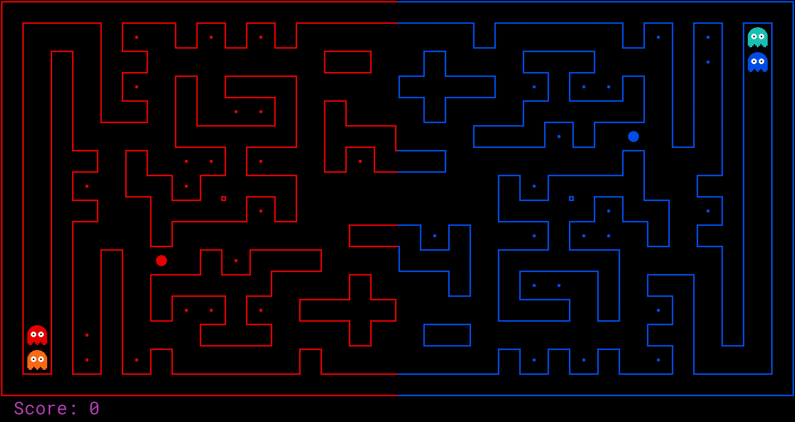
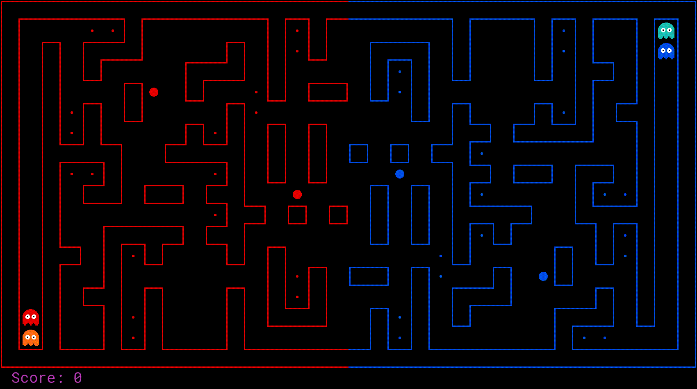

# Project 4: Pacman Capture the Flag

<p align="center">
    
    </br>
    Enough of defense,</br>
    Onto enemy terrain.</br>
    Capture all their food!
</p>

## Introduction

The final project involves a multi-player capture-the-flag variant of Pacman,
where agents control both Pacman and ghosts in coordinated team-based strategies.
Your team will try to eat the food on the far side of the map, while defending the food on your home side.

The project will consist of three phases:

1. The first phase will consist of finding a team (of no more than three people) and an initial test of the tournament.
   Students must have a team and at **minimum** must submit a
   [DummyAgent](https://linqs.github.io/pacman/docs/latest/pacai/agents/capture/dummy.html#pacai.agents.capture.dummy.DummyAgent) for this phase.
2. The second phase will consist of daily round-robin style tournaments.
   During this phase students should improve their agent, while looking for weaknesses in their opponents' submissions.
3. The final phase will be a final round-robin style tournament, in which students show their best.
   This is students' final chance to shine, winner takes all!

All of the deadlines for these events will exist on **Canvas**.
Make sure you check early, **do not** miss a deadline!

We will evaluate your submissions based on a short written report (2-3 pages) on your modeling of the problem and agent design,
as well as your performance against the baseline agents and your classmates in tournament play.

### Submission

To enter into the nightly tournaments, your team's agents and all relevant functions must be defined in
[pacai.student.myTeam](https://linqs.github.io/pacman/docs/latest/pacai/student/myTeam.html).

Every team must have a unique name,
consisting only of ASCII letters and digits (any other characters, including whitespace, will be ignored).

Instructions for forming groups (using Canvas groups) are posted on Canvas.
You must submit your team info (team name, motto and list of members).

In every submission to the autograder (linked below),
you must include a file `name.txt` in which you will write only your unique team name.
**Do not** include other extraneous text in this file.
Only your team name will be displayed to the rest of the class.
You will fill in portions of `pacai/student/multiagents.py` during this assignment.
You should **only** submit these two files.

For instructions on submission,
refer back to the [P0 README](../p0/README.md).
for example, you may submit with the command:
```sh
python3 -m autograder.run.submit pacai/student/myTeam.py pacai/student/name.txt
```

For your **report submission**, upload a file named `[your team name].pdf` that contains your write-up to Canvas.
Please make sure that this document contains the names of all members of your team clearly stated at the top.

### Evaluation

The contest will count as your final project, worth 40 points.
20 of these points will be the result of a written report you submit with your agent describing your approach.
The remaining 20 points will be awarded based on your agent's performance.

The written report should be 2-3 pages **(no more)**.
Through this report we expect you to demonstrate your ability to constructively solve AI problems by identifying:
- The fundamental problems you are trying to solve.
- How you modeled these problems.
- Your representations of the problems.
- The computational strategy used to solve each problem.
- Algorithmic choices you made in your implementation.
- Any obstacles you encountered while solving the problem.
- Evaluation of your agent.
- Lessons learned during the project.

A portion of your grade will be based on performance against the following staff agents:
- staff_baseline
- staff_SlugTrap
- staff_SomeSlug
- staff_SlugBrain

Points are also awarded as follows:
- If you lose to the dummy agent, zero points will be awarded for this section.
- 10 points for beating the staff_baseline agent.
- +5 points for beating one additional staff agent. (15 points for beating the staff_baseline agent and one of the additional staff agents).
- +5 points for beating 2 staff agents (in addition to staff_baseline), OR.
  - +1 points for being in the top 50%.
  - +2 points for being in the top 40%.
  - +3 points for being in the top 30%.
  - +4 points for being in the top 20%.
  - +5 points for being in the top 10%.
- +1 Extra Credit point for being the number one team.

How we compute the percentiles based on the ranking of the teams is described below in [Contest Details](#contest-details).

### Academic Dishonesty

We will be checking your code against other submissions in the class for logical redundancy.
If you copy someone else's code and submit it with minor changes, we will know.
These cheat detectors are quite hard to fool, so please don't try.
We trust you all to submit your own work only; _please_ don't let us down.
If you do, we will pursue the strongest consequences available to us.

### Getting Help

You are not alone!
If you find yourself stuck on something, contact the course staff for help.
Office hours, section, and Piazza are there for your support; please use them.
If you can't make our office hours, let us know and we will schedule more.
We want these projects to be rewarding and instructional, not frustrating and demoralizing.
But, we don't know when or how to help unless you ask.
One more piece of advice: if you don't know what a variable does or what kind of values it takes, print it out.

## Pacman Capture the Flag

### Layout

The Pacman map is now divided into two halves: red (left) and blue (right).
Red agents (which all have even indices) must defend the red food while trying to eat the blue food.
When on the red side, a red agent is a ghost.
When crossing into enemy territory, the agent becomes a Pacman.

By default, all games are run on the `defaultcapture` layout.
To test your agent on other layouts, use the `--layout` option.
In particular, you can generate random layouts by specifying `RANDOM[seed]`.
For example, `--layout RANDOM140` will use a map randomly generated with seed 140.

### Scoring

When a Pacman eats a food dot, the food is permanently removed and one point is scored for that Pac-Man's team.
Red team scores are positive, while Blue team scores are negative.

### Eating Pacman

When a Pacman is eaten by an opposing ghost, the Pacman returns to its starting position (as a ghost).
No points are awarded for eating an opponent.

### Power capsules

If Pacman eats a power capsule, agents on the opposing team become "scared" for the next 40 moves,
or until they are eaten and respawn, whichever comes sooner.
Agents that are "scared" are susceptible while in the form of ghosts (i.e. while on their own team's side) to being eaten by Pacman.
Specifically, if Pacman collides with a "scared" ghost,
Pacman is unaffected and the ghost respawns at its starting position (no longer in the "scared" state).

### Winning

A game ends when one team eats all but two of the opponents' dots.
Games are also limited to 1200 agent moves (300 moves per each of the four agents).
If this move limit is reached, whichever team has eaten the most food wins.
If the score is zero (i.e., tied) this is recorded as a tie game.

### Computation Time

We will run your submissions on a VM server.
Each move which does not return within one second will incur a warning.
After three warnings, or any single move taking more than 3 seconds, the game is forfeit.
There will be an initial start-up allowance of 15 seconds
(use the [pacai.agents.capture.capture.CaptureAgent.registerInitialState](https://linqs.github.io/pacman/docs/latest/pacai/agents/capture/capture.html#pacai.agents.capture.capture.CaptureAgent.registerInitialState) function).
If you agent times out or otherwise throws an exception,
an error message will be present in the log files, which you can download from the results page (see below).

## Getting Started

By default, you can run a game with the simple
[pacai.core.baselineTeam](https://linqs.github.io/pacman/docs/latest/pacai/core/baselineTeam.html) that the staff has provided:
```sh
python3 -m pacai.bin.capture
```

A wealth of options are available to you:
```sh
python3 -m pacai.bin.capture --help
```

There are four slots for agents, where agents 0 and 2 are always on the red team, and agents 1 and 3 are on the blue team.
See the section on designing agents for a description of the agents invoked above.
The only team that we provide is the [baselineTeam](https://linqs.github.io/pacman/docs/latest/pacai/core/baselineTeam.html).
It is chosen by default as both the red and blue team, but as an example of how to choose teams:
```sh
python3 -m pacai.bin.capture --red pacai.core.baselineTeam --blue pacai.core.baselineTeam
```

which specifies that the red team `--red` and the blue team `--blue` are both created from
[baselineTeam](https://linqs.github.io/pacman/docs/latest/pacai/core/baselineTeam.html).
To control one of the four agents with the keyboard, pass the appropriate option:
```sh
python3 -m pacai.bin.capture --keys0
```

The arrow keys control your character, which will change from ghost to Pacman when crossing the center line.

### Official Tournaments

Round-robin contests will be run using nightly automated tournaments on the course server,
with the final tournament deciding the final contest outcomes.
See the submission instructions for details of how to enter a team into the tournaments.
Tournaments are run every night (refer to Canvas for nightly cut off) and include all teams that have been submitted
(either earlier in the day or on a previous day) as of the start of the tournament.
Currently, each team plays every other team 15 times in one match.

The layouts used in the tournament will be drawn from both the default layout (5 games),
as well as randomly generated layouts (10 games).
All layouts are symmetric, and the team that moves first is randomly chosen.
The results for a nightly tournaments can be found [here (TBA)](#), where you can view overall rankings and scores for each match.
You can also download replays, the layouts used, and the stdout / stderr logs for each agent.

## Designing Agents

Unlike the other projects,
an agent now has the more complex job of trading off offense versus defense and effectively functioning as both a ghost and a Pacman in a team setting.
Furthermore, the limited information provided to your agent will likely necessitate some probabilistic tracking.
Finally, the added time limit of computation introduces new challenges.

### Baseline Team

To kickstart your agent design, we have provided you with a team of two baseline agents,
defined in [pacai.core.baselineTeam](https://linqs.github.io/pacman/docs/latest/pacai/core/baselineTeam.html).
They are both quite bad.
The [pacai.agents.capture.offense.OffensiveReflexAgent](https://linqs.github.io/pacman/docs/latest/pacai/agents/capture/offense.html#pacai.agents.capture.offense.OffensiveReflexAgent)
moves toward the closest food on the opposing side.
The [pacai.agents.capture.defense.DefensiveReflexAgent](https://linqs.github.io/pacman/docs/latest/pacai/agents/capture/defense.html#pacai.agents.capture.defense.DefensiveReflexAgent)
wanders around on its own side and tries to chase down invaders it happens to see.

### File naming

For the purpose of testing or running games locally,
you can define a team of agents in any arbitrarily-named python file.
When submitting to the nightly tournament, however,
you must define your agents in [pacai.student.myTeam](https://linqs.github.io/pacman/docs/latest/pacai/student/myTeam.html)
(and you must also create a `name.txt` file that specifies your team name).

### Interface

The [pacai.bin.capture.CaptureGameState](https://linqs.github.io/pacman/docs/latest/pacai/bin/capture.html#pacai.bin.capture.CaptureGameState) should look familiar,
but contains new methods like [getRedFood](https://linqs.github.io/pacman/docs/latest/pacai/bin/capture.html#pacai.bin.capture.CaptureGameState.getRedFood),
which gets a grid of food on the red side (note that the grid is the size of the board,
but is only true for cells on the red side with food).
Also, note that you can list a team's indices with [getRedTeamIndices](https://linqs.github.io/pacman/docs/latest/pacai/bin/capture.html#pacai.bin.capture.CaptureGameState.getRedTeamIndices),
or test membership with [isOnRedTeam](https://linqs.github.io/pacman/docs/latest/pacai/bin/capture.html#pacai.bin.capture.CaptureGameState.isOnRedTeam).

### Distance Calculation

To facilitate agent development,
we provide code in [pacai.core.distanceCalculator](https://linqs.github.io/pacman/docs/latest/pacai/core/distanceCalculator.html#pacai.core.distanceCalculator.DistanceCalculator) to supply shortest path maze distances.

### Useful Methods

To get started designing your own agent,
we recommend subclassing the [pacai.agents.capture.capture.CaptureAgent](https://linqs.github.io/pacman/docs/latest/pacai/agents/capture/capture.html#pacai.agents.capture.capture.CaptureAgent) class.
This provides access to several convenience methods.
Some of these useful methods are:

- [getFood](https://linqs.github.io/pacman/docs/latest/pacai/agents/capture/capture.html#pacai.agents.capture.capture.CaptureAgent.getFood)
- [getFoodYouAreDefending](https://linqs.github.io/pacman/docs/latest/pacai/agents/capture/capture.html#pacai.agents.capture.capture.CaptureAgent.getFoodYouAreDefending)
- [getOpponents](https://linqs.github.io/pacman/docs/latest/pacai/agents/capture/capture.html#pacai.agents.capture.capture.CaptureAgent.getOpponents)
- [getTeam](https://linqs.github.io/pacman/docs/latest/pacai/agents/capture/capture.html#pacai.agents.capture.capture.CaptureAgent.getTeam)
- [getScore](https://linqs.github.io/pacman/docs/latest/pacai/agents/capture/capture.html#pacai.agents.capture.capture.CaptureAgent.getScore)
- [getMazeDistance](https://linqs.github.io/pacman/docs/latest/pacai/agents/capture/capture.html#pacai.agents.capture.capture.CaptureAgent.getMazeDistance)
- [getPreviousObservation](https://linqs.github.io/pacman/docs/latest/pacai/agents/capture/capture.html#pacai.agents.capture.capture.CaptureAgent.getPreviousObservation)
- [getCurrentObservation](https://linqs.github.io/pacman/docs/latest/pacai/agents/capture/capture.html#pacai.agents.capture.capture.CaptureAgent.getCurrentObservation)

### Restrictions

You are free to design any agent you want.
However, you will need to respect the provided APIs if you want to participate in the tournaments.
Agents which compute during the opponent's turn will be disqualified.
In particular, any form of parallelism is disallowed,
because we have found it very hard to ensure that no computation takes place on the opponent's turn.

### Warning

If one of your agents produces any stdout/stderr output during its games in the nightly tournaments,
that output will be included in the contest results posted on the website.
Additionally, in some cases a stack trace may be shown among this output in the event that one of your agents throws an exception.
You should design your code in such a way that this does not expose any information that you wish to keep confidential.

## Contest Details

### Teams

We highly encourage you to work in teams of three people (no more than three).

### Prizes

The performance-based portion of your grade will be based on the placement received in **the final** round-robin tournament.
Placement is determined by the number of wins
(if multiple teams have the same number of wins, it will be broken by the number of ties).

### Extra Credit

Winners in the mid-project checkpoint contest will receive points as follows:
3 points for 1st place, 2 points for 2nd place, and 1 point for third place.

<p align="center">
    
    </br>
    Have fun!</br>
    Please bring our attention to any problems you discover.
</p>
